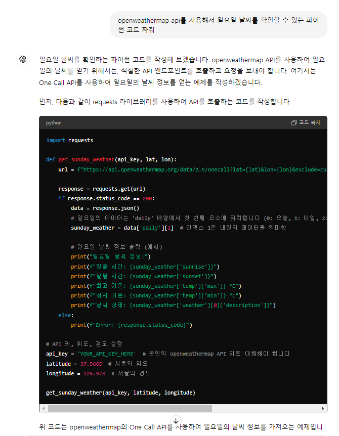
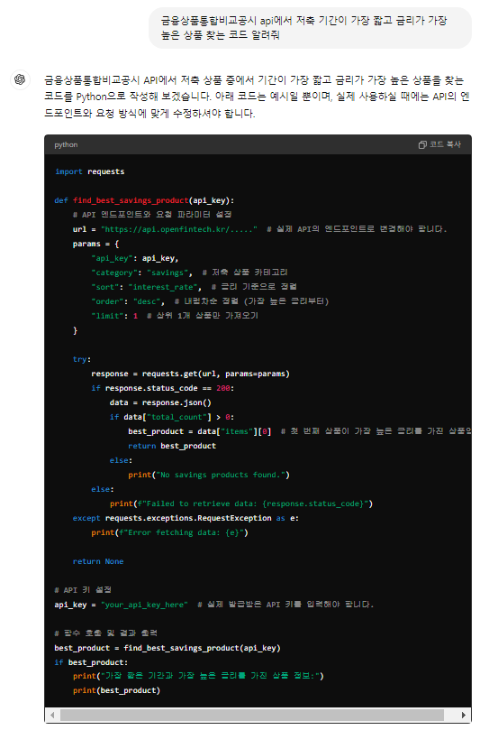

# 01-pjt

### 오늘 pjt 를 통해 배운 내용

* API 요청하는 방법을 알게 됐다.

* API 요청으로 받아온 데이터의 구조를 알고 원하는 형태로 가공할 수 있다.

-----
## 문제3. B번에서 얻는 결과를 활용하여, KEY 값들을 한글로 변경한 딕셔너리를 반환하도록 구성합니다.

* 주요 요구 사항 : key 값을 변경

* 결과 : 영어로 된 key 값을 한글로 변경
  
* 기억해볼 부분

  ```python
  dictionary[new_key] = dictionary.pop(old_key)
  ```

  * .pop()을 활용해서 key 값을 변경할 수 있다

  * 공식 문서에서 언어 변경을 지원한다는 것을 찾을 수 있었다.

  <!-- * 트러블 슈팅한 부분
  
    ```
    트러블 코드 조각
    ```
  
    * 트러블 현상 및 에러 정보
    * 원인 및 해결 방법 -->


## E. 생성형 AI 활용하기

* 생성형 AI 를 활용하여 자유롭게 데이터를 수집하고, 추출하고 가공해봅니다.

* 결과 : chat-Gpt를 활용해 일요일 날씨 정보 확인

* 

  * 트러블 슈팅한 부분

    * code 401 에러 발생

```python
def get_sunday_weather(api_key, lat, lon):
url = f"https://api.openweathermap.org/data/2.5/onecall?lat={lat}&lon={lon}&exclude=current,minutely,hourly,alerts&appid={api_key}&units=metric"

response = requests.get(url)
if response.status_code == 200:
    data = response.json()
    sunday_weather = data['daily'][0]  # 인덱스 0은 내일의 데이터를 의미함 (0: 오늘, 1: 내일, 2: 모레, ...)
    
    print("일요일 서울 날씨 정보:")
    print(f"최고 기온: {sunday_weather['temp']['max']} °C")
    print(f"최저 기온: {sunday_weather['temp']['min']} °C")
    print(f"날씨 상태: {sunday_weather['weather'][0]['description']}")
else:
    print(f"Error: {response.status_code}")
```
-> 변경

  ```python
      import requests

      def get_sunday_weather(api_key, city):
          url = f"http://api.openweathermap.org/data/2.5/weather?q={city}&appid={api_key}&units=metric"
          
          response = requests.get(url)
          if response.status_code == 200:
              data = response.json()
              print(f"{city}의 현재 날씨 정보:")
              print(f"기온: {data['main']['temp']} °C")
              print(f"습도: {data['main']['humidity']} %")
              print(f"날씨 상태: {data['weather'][0]['description']}")
          else:
        print(f"Error: {response.status_code}, {response.text}")
  ```
  * 트러블 현상 및 에러 정보

    - Chat Gpt가 알려준 One Call API는 2024년 6월부터 3.0 버전으로 넘어가면서 구독이 필요해진 것으로 확인됐다.

  * 원인 및 해결 방법

    - 기존 실습에서 사용했던 Current Weater API를 활용해서 일요일 서울 날씨를 확인할 수 있었다.

* 심화 프로젝트 생성형 AI 활용

  * 

  * Chat Gpt가 알려준 API 서버는 없는 서버였다.

    - 금융상품통합비교공시 API라고 명시해줬지만 API 서버를 제대로 찾지 못했다.

    - API url 주소를 명시해주니까 새로운 코드를 줬다.

    - 그런데 없는 키 값에 접근하고 있었다.

    - 적절한 키 값을 찾아 수정하고 자료형을 변경해 주었더니 조건에 맞는 금융상품을 찾아주었다.

## 오늘 후기

* API를 사용하는 경험을 쌓는 것이 좋았다.

* Chat Gpt를 사용하는 것은 생각보다 어렵다.

  * 어떤 정보가 옳고 어디서 틀렸는지 파악하는 것이 어렵다.

* 후기를 적는 경험이 색다르다.


### 참고 사이트

* [파이썬 공식 문서 JSON 파트](https://docs.python.org/3.9/library/json.html)
* [OpenWeatherMap](https://openweathermap.org/)
