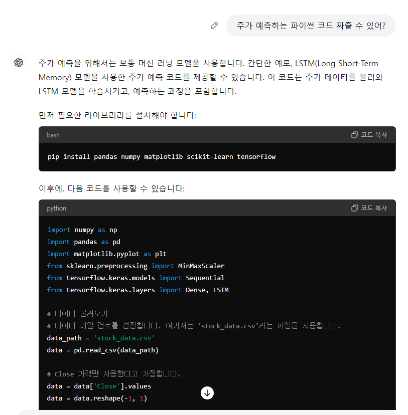
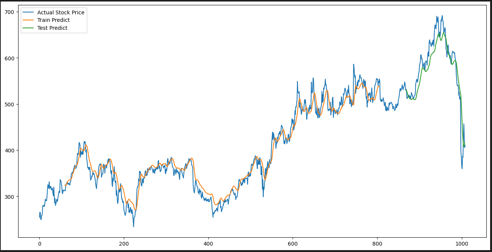

# 02-pjt

### 오늘 pjt 를 통해 배운 내용

* 생성형 AI를 이용해 머신러닝 모델을 만들 수 있다.

-----
## 생성형 AI를 이용해 작성한 코드

* Gpt가 작성해주는 코드에는 문제가 있다.

* 이번에 발생한 문제는 numpy와 tensorflow의 버전이 상호 호환되지 않아서 발생하는 것으로 보인다.

  * 트러블 슈팅한 부분
  
    ```python 
      Unexpected exception formatting exception. Falling back to standard exception
    Traceback (most recent call last):
      File "C:\Users\SSAFY\AppData\Roaming\Python\Python39\site-packages\IPython\core\interactiveshell.py", line 3550, in run_code
        exec(code_obj, self.user_global_ns, self.user_ns)
      File "C:\Users\SSAFY\AppData\Local\Temp\ipykernel_776\1391688237.py", line 7, in <module>
        from sklearn.preprocessing import MinMaxScaler
      File "c:\Users\SSAFY\AppData\Local\Programs\Python\Python39\lib\site-packages\sklearn\__init__.py", line 84, in <module>
        from .base import clone
      File "c:\Users\SSAFY\AppData\Local\Programs\Python\Python39\lib\site-packages\sklearn\base.py", line 19, in <module>
        from .utils._estimator_html_repr import _HTMLDocumentationLinkMixin, estimator_html_repr
      File "c:\Users\SSAFY\AppData\Local\Programs\Python\Python39\lib\site-packages\sklearn\utils\__init__.py", line 11, in <module>
        from ._chunking import gen_batches, gen_even_slices
      File "c:\Users\SSAFY\AppData\Local\Programs\Python\Python39\lib\site-packages\sklearn\utils\_chunking.py", line 8, in <module>
        from ._param_validation import Interval, validate_params
      File "c:\Users\SSAFY\AppData\Local\Programs\Python\Python39\lib\site-packages\sklearn\utils\_param_validation.py", line 11, in <module>
        from scipy.sparse import csr_matrix, issparse
      File "c:\Users\SSAFY\AppData\Local\Programs\Python\Python39\lib\site-packages\scipy\sparse\__init__.py", line 294, in <module>
        from ._base import *
      File "c:\Users\SSAFY\AppData\Local\Programs\Python\Python39\lib\site-packages\scipy\sparse\_base.py", line 5, in <module>
        from scipy._lib._util import VisibleDeprecationWarning
      File "c:\Users\SSAFY\AppData\Local\Programs\Python\Python39\lib\site-packages\scipy\_lib\_util.py", line 18, in <module>
        from scipy._lib._array_api import array_namespace
      File "c:\Users\SSAFY\AppData\Local\Programs\Python\Python39\lib\site-packages\scipy\_lib\_array_api.py", line 17, in <module>
        from scipy._lib.array_api_compat import (
      File "c:\Users\SSAFY\AppData\Local\Programs\Python\Python39\lib\site-packages\scipy\_lib\array_api_compat\numpy\__init__.py", line 1, in <module>
        from numpy import *
    
        return only(
      File "C:\Users\SSAFY\AppData\Roaming\Python\Python39\site-packages\executing\executing.py", line 116, in only
        raise NotOneValueFound('Expected one value, found 0')
      executing.executing.NotOneValueFound: Expected one value, found 0
    ```
  
    * 트러블 현상 및 에러 정보 : 찾아보니 numpy와 tensorflow가 호환되지 않는 버전으로 설치되어서 발생한 문제였다.

    * 원인 및 해결 방법 : numpy를 삭제하고 낮은 버전(1.26.3)으로 재설치 하고 vscode를 재실행하니 해결되었다.


## 생성형 AI 를 활용하여 주가 예측하기

* 생성형 AI 를 활용하여 주식 가격 예측하기

* 결과 : chat-Gpt를 활용해 ml 모델(LSTM)로 주식 가격 예측하기

  LSTM 모델은 sequence 데이터가 필요하기 때문에 데이터 형태를 변환해 주는 과정이 필요하다.

 


```python
# F. 생성형 AI 를 활용하여 주가 예측하기
# pip install scikit-learn tensorflow

import numpy as np
import pandas as pd
import matplotlib.pyplot as plt
from sklearn.preprocessing import MinMaxScaler
from tensorflow.keras.models import Sequential  
from tensorflow.keras.layers import Dense, LSTM 


# Close 가격만 사용한다고 가정합니다.
data = data['Close'].values
data = data.reshape(-1, 1)

# 데이터 정규화
scaler = MinMaxScaler(feature_range=(0, 1))
scaled_data = scaler.fit_transform(data)

# 훈련 데이터 생성
train_size = int(len(scaled_data) * 0.8)
train_data = scaled_data[:train_size]
test_data = scaled_data[train_size:]

def create_dataset(dataset, time_step=1):
    dataX, dataY = [], []
    for i in range(len(dataset) - time_step - 1):
        a = dataset[i:(i + time_step), 0]
        dataX.append(a)
        dataY.append(dataset[i + time_step, 0])
    return np.array(dataX), np.array(dataY)

time_step = 60
X_train, y_train = create_dataset(train_data, time_step)
X_test, y_test = create_dataset(test_data, time_step)

# 입력 데이터 형태 변경 [samples, time steps, features]
X_train = X_train.reshape(X_train.shape[0], X_train.shape[1], 1)
X_test = X_test.reshape(X_test.shape[0], X_test.shape[1], 1)

# LSTM 모델 생성
model = Sequential()
model.add(LSTM(50, return_sequences=True, input_shape=(time_step, 1)))
model.add(LSTM(50, return_sequences=False))
model.add(Dense(25))
model.add(Dense(1))

# 모델 컴파일 및 학습
model.compile(optimizer='adam', loss='mean_squared_error')
model.fit(X_train, y_train, batch_size=1, epochs=1)

# 예측 및 역정규화
train_predict = model.predict(X_train)
test_predict = model.predict(X_test)

train_predict = scaler.inverse_transform(train_predict)
test_predict = scaler.inverse_transform(test_predict)

# 시각화
plt.figure(figsize=(16, 8))
plt.plot(data, label='Actual Stock Price')
plt.plot(range(time_step, len(train_predict) + time_step), train_predict, label='Train Predict')
plt.plot(range(len(train_predict) + (time_step * 2) + 1, len(data) - 1), test_predict, label='Test Predict')
plt.legend()
plt.show()
```

* 

## 오늘 후기

* Gpt가 모델을 만들어주고 시각화까지 해주는 것이 간편한 과정이었다.

* 코드 중간에 잘못된 부분이 있는지 확인이 필요했다.

  * 어떤 정보가 옳고 어디서 틀렸는지 파악해야 한다.

* 미래 주가를 예측하는 부분이 빠져 있었다. -> 사용한 데이터는 날짜, 시가, 최고가, 최저가, 거래량이고 예측하는 데이터는 종가 데이터였다.

  -> 미래 시점의 날짜, 시가, 고가, 저가, 거래량을 알 수 있다면 종가를 예측할 수 있다.

* 원본 데이터를 시퀀스 형태의 데이터로 변환하는 과정이 필요하다.